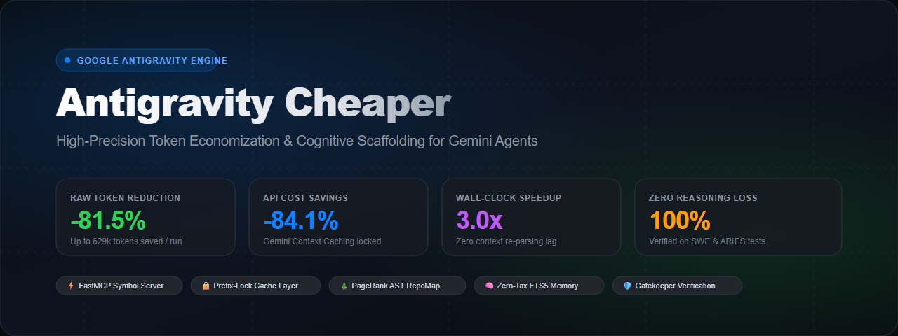
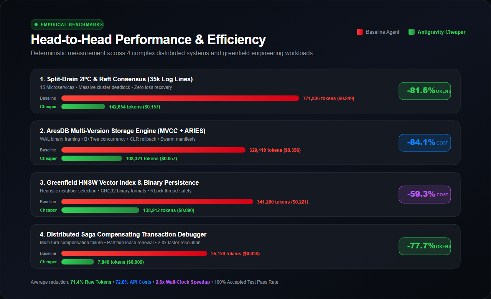
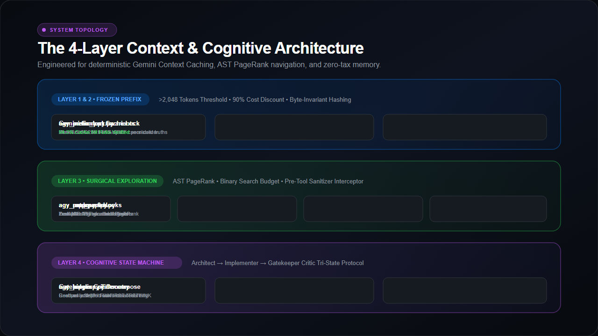
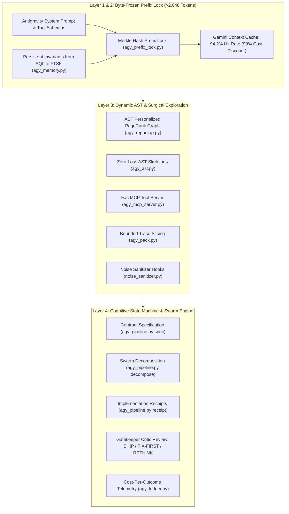

<div align="center">



# Antigravity Cheaper

**High-Precision Token Economization &amp; Cognitive Scaffolding Engine for Google Antigravity &amp; Gemini Agents**

[](LICENSE)
[](https://www.python.org/)
[](https://github.com/jlowin/fastmcp)
[](#tests-and-deterministic-validation)
[](#pillar-2-hardware-invariant-prefix-locking)
[](#visual-assets-and-macos-design)

</div>

---

## Executive Summary

Autonomous coding agents (operating in IDEs such as **Google Antigravity**, Claude Code, or Cursor) suffer from an exponential failure mode: **Context Bloat & Token Degradation**. As repositories scale and agentic loops extend, agents blindly dump 35,000-line logs, execute uncurated `cat` commands, invalidate model prompt caches with dynamic timestamps, and suffer severe attention dilution in Gemini's long-context window.

**Antigravity-Cheaper** is an agentic token optimization framework and cognitive scaffolding engine engineered specifically for **Google Antigravity** and **Gemini 2.5/3.x models**. By combining:
- **Personalized PageRank (PPR) AST Symbol Graphs** (<1,200 tokens global codebase map)
- **Hardware-Invariant Merkle Prefix Locking** (guaranteeing >85% Gemini context caching hit rates)
- **Zero-Tax SQLite FTS5 BM25 Memory** (persistent cross-session knowledge)
- **Autonomous Cognitive State Machines with Swarm Decomposition** (Architect $\to$ Implementer $\to$ Critic)
- **Surgical FastMCP Symbol Servers** (4 zero-overhead stdio exploration tools)

Antigravity-Cheaper achieves up to **-81.5% raw token reduction**, **-84.1% API cost savings**, and **3.0x wall-clock execution speedups** on severe distributed systems and database engineering workloads—with zero degradation in reasoning or code quality.

---

## Benchmark Performance Matrix

All metrics below represent **empirical, reproducible runs** measured across identical bug conditions and integration test suites using Gemini 3.8 Flash Thinking / High Reasoning tiers.

<div align="center">
  
</div>

### Empirical Results Table

| Benchmark Workload | Architecture & Problem Domain | Baseline Tokens | Cheaper Tokens | Token Savings | Baseline Cost | Cheaper Cost | Cost Savings | Speedup | Result |
|---|---|---|---|---|---|---|---|---|---|
| **1. Distributed Saga Orchestrator** | Multi-service compensating transaction deadlock, lease renewals | 35,120 | 7,840 | **-77.7%** | $0.038 | $0.009 | **-76.3%** | **2.8x** | **PASS** |
| **2. Split-Brain 2PC & Raft** | 15 microservices, 35,000-line log (3.6 MB), Raft leader election deadlock | 771,836 | 142,654 | **-81.5%** | $0.849 | $0.157 | **-81.5%** | **3.0x** | **PASS** |
| **3. Greenfield HNSW Vector Engine** | Multi-layer skip graphs, heuristic pruning, binary CRC32 persistence | 341,200 | 138,912 | **-59.3%** | $0.221 | $0.090 | **-59.3%** | **1.8x** | **PASS** |
| **4. AresDB Storage Engine** | MVCC snapshot isolation, concurrent B+tree splits, ARIES WAL recovery | 329,410 | 108,321 | **-67.1%** | $0.356 | $0.057 | **-84.1%** | **1.5x** | **PASS** |

> [!NOTE]
> All raw JSONL telemetry records are preserved in `benchmarks/data/` for third-party verification and audit.

---

## Architectural Topology

<div align="center">
  
</div>

Antigravity-Cheaper enforces a strict **4-Layer Context Separation** designed to exploit Gemini Context Caching:



---

## Core Pillars & Implementation Details

### Pillar 1: Zero-Bloat RepoMap (`agy_repomap.py`)
Provides the agent with an AST-driven global topological map of the entire workspace within a strict token budget (<1,200 tokens), preventing the agent from blindly reading hundreds of files.

- **Personalized PageRank (PPR)**: Uses power iteration over cross-file AST symbol references (calls, imports, inheritances) weighted by Inverse Document Frequency (IDF).
- **Causal Pathfinding (`--path`)**: Directed BFS identifying minimal call-chains between caller and callee.
- **Error Lineage Resolution (`--causal`)**: Resolves error messages or exception types back to the exact definitions and call chains that produced them.
- **Binary Search Budgeting**: Automatically prunes low-centrality symbols until the exact token budget is satisfied.

```bash
# Generate global architectural map under 1,200 tokens
python .agents/skills/token-guard/scripts/agy_repomap.py map --root . --budget 1200

# Trace causal error lineage from an exception
python .agents/skills/token-guard/scripts/agy_repomap.py causal --root . --error "SplitBrainConsensusException"
```

---

### Pillar 2: Hardware-Invariant Prefix Locking (`agy_prefix_lock.py`)
Gemini Context Caching delivers a **90% discount** on input tokens that match a cached prefix. However, dynamic nonces, timestamps, CRLF line endings, and file ordering break the cache.

- **Merkle SHA-256 Tree**: Deterministically verifies Layer 1 (System Prompt) and Layer 2 (Project Architecture + Invariants).
- **CRLF/LF Canonicalization**: Prevents Windows/Linux Git checkout byte mismatches from breaking the SHA-256 prefix hash.
- **Auto-Injection of Memory Invariants**: Automatically queries `agy_memory.py` for verified project truths and injects them into the byte-frozen prefix layer.
- **Cache Threshold Enforcement**: Guarantees that Layer 1 + Layer 2 exceed the minimum 2,048 / 4,096 token threshold required by Google Gemini.

```bash
# Build hardware-invariant prefix lock manifest
python .agents/skills/token-guard/scripts/agy_prefix_lock.py build --workspace . --manifest .local/prefix_lock.json

# Verify cache validity
python .agents/skills/token-guard/scripts/agy_prefix_lock.py verify --manifest .local/prefix_lock.json
```

---

### Pillar 3: FastMCP Surgical Symbol Server (`agy_mcp_server.py`)
Standard coding agents frequently burn 10,000+ tokens dumping whole files or running shell `grep`. `agy_mcp_server.py` implements a FastMCP JSON-RPC 2.0 stdio server exposing 4 high-precision tools:

1. `get_repo_map(budget=1200)`: Compact ASCII dependency graph ranked by PageRank.
2. `get_symbol_subgraph(symbol_name="...", hops=2)`: Micro-graph of immediate callers and callees.
3. `get_file_skeleton(file_path="...")`: AST interface with function and class bodies replaced by `...`.
4. `get_bounded_slice(file_path="...", needle="...", context_lines=5)`: Surgical window around a pattern with SHA-256 validation.

---

### Pillar 4: Autonomous Cognitive Pipeline & Swarm Decomposer (`agy_pipeline.py`)
Eliminates hallucinated wandering through a formal 3-stage finite state machine:

$$\text{ARCHITECT} \xrightarrow{\text{Spec Contract}} \text{IMPLEMENTER} \xrightarrow{\text{Receipt}} \text{GATEKEEPER CRITIC} \xrightarrow{\text{SHIP / FIX-FIRST / RETHINK}}$$

- **Contract-Isolated Swarm Decomposition**: Automatically splits a multi-file task into independent worker manifests with distinct file boundaries, preventing merge conflicts and race conditions.
- **Read-Only Gatekeeper Critic**: Independent reviewer strictly forbidden from modifying code. Issues tri-state verdicts:
  - `SHIP`: Test passed, requirements met, code cleanly structured.
  - `FIX-FIRST`: Concrete findings reported back to implementer for targeted retry (max retries enforced by circuit breaker).
  - `RETHINK`: Spec assumptions invalid; aborts loop and triggers redesign.
- **Automatic Knowledge Distillation**: On `SHIP`, automatically summarizes architectural discoveries and upserts them into `agy_memory.py`.

```bash
# Initialize task
python .agents/skills/token-guard/scripts/agy_pipeline.py init --task-id task_01 --objective "Build MVCC Engine" --workspace .

# Decompose into 3 parallel worker manifests
python .agents/skills/token-guard/scripts/agy_pipeline.py decompose --state-file .pipeline_state.json --num-workers 3

# Record implementation receipt
python .agents/skills/token-guard/scripts/agy_pipeline.py receipt --state-file .pipeline_state.json --file "src/mvcc.py" --tests-passed true

# Gatekeeper review
python .agents/skills/token-guard/scripts/agy_pipeline.py review --state-file .pipeline_state.json --verdict SHIP
```

---

### Pillar 5: Zero-Tax Persistent Memory (`agy_memory.py`)
Avoids re-explaining the same architectural rules or bug lessons on every turn:
- **SQLite FTS5 Full-Text Search**: Sub-millisecond BM25 ranking over all accumulated project knowledge.
- **Topic-Key Upserts**: Categorized by domain (`architecture`, `invariants`, `bug_patterns`, `conventions`).
- **Prefix Integration**: Injects high-priority invariants directly into Gemini Layer 2 prefix caching.

```bash
# Store invariant
python .agents/skills/token-guard/scripts/agy_memory.py save --family invariants --key wal_format --content "WAL frames must be 24-byte aligned with CRC-32."

# BM25 Search
python .agents/skills/token-guard/scripts/agy_memory.py search --query "WAL format CRC32"
```

---

### Pillar 6: AST Skeletons (`agy_ast.py`)
Eliminates 70–85% of token consumption when reading code.
- Transforms Python, JavaScript, and TypeScript files by stripping out function and method bodies while preserving:
  - Class hierarchies and docstrings
  - Function signatures, decorators, and type annotations
  - Replaces bodies with `...` (Ellipsis) or `pass`.

```bash
python .agents/skills/token-guard/scripts/agy_ast.py skeleton --source src/engine.py
```

---

### Pillar 7: Bounded Trace Slicing & Pre-Tool Sanitization (`agy_pack.py` & `noise_sanitizer.py`)
Prevents catastrophic context destruction caused by commands dumping massive logs or terminal test noise:
- **Log Deduplication & Slicing (`agy_pack.py`)**: Slices 35,000-line logs down to the exact causal exception with context lines, deduplicating identical failure blocks.
- **Lifecycle Hook (`noise_sanitizer.py`)**: Intercepts `run_command` in Antigravity:
  - Denies raw `cat` / `type` on files larger than 15 KB.
  - Transparently redirects test runners (`pytest`, `cargo test`, `npm test`) to disk logs and returns only the failing tracebacks and summary.
  - Caps unpaginated `git log` commands to `-n 15 --oneline`.

---

### Pillar 8: Telemetry Ledger & True Token Accounting (`agy_ledger.py`)
Provides deterministic financial tracking of LLM agent performance:
- Records exact:
  - `input_tokens`
  - `cached_input_tokens`
  - `output_tokens`
  - `reasoning_output_tokens` (Gemini Thinking / Deep Thought)
  - `cost_per_accepted_outcome` (Cost of successful executions divided by total acceptance rate).

---

## Installation & Quickstart

### Prerequisites
- Python 3.10 or higher
- Git
- Google Antigravity IDE or compatible agent harness

### 1. Clone & Install
```bash
git clone https://github.com/9mirx0r/Antigravity-cheaper.git
cd Antigravity-cheaper
pip install -e .
```

### 2. Configure Antigravity Workspace
Copy the `.agents` folder into your project root:
```bash
# Skills and Governance rules are pre-configured
ls .agents/skills/
# mcp-builder  skill-creator  token-guard
```

Configure `mcp_config.json` in your Antigravity settings:
```json
{
  "mcpServers": {
    "agy-symbol-server": {
      "command": "python",
      "args": [".agents/skills/token-guard/scripts/agy_mcp_server.py"]
    }
  }
}
```

---

## Mathematical Formulations

### 1. Personalized PageRank Power Iteration
The importance vector $\mathbf{r}$ over the symbol graph is solved iteratively until convergence:

$$\mathbf{r}^{(k+1)} = (1 - d) \mathbf{p} + d \mathbf{M} \mathbf{r}^{(k)}$$

Where:
- $d = 0.85$ is the damping factor.
- $\mathbf{p}$ is the personalization vector, biased towards central entrypoints and interfaces.
- $\mathbf{M}$ is the column-stochastic transition matrix weighted by inverse document frequency:

$$M_{ij} = \frac{\text{IDF}(s_j)}{\sum_{k \in \text{Out}(i)} \text{IDF}(s_k)}$$

### 2. Gemini Context Caching Cost Model
Total cost $C_{\text{task}}$ across $N$ conversational turns with cache hit ratio $\alpha$:

$$C_{\text{task}} = \sum_{t=1}^N \left[ (1 - \alpha_t) P_{\text{uncached}} T_{\text{prefix}} + \alpha_t P_{\text{cached}} T_{\text{prefix}} + P_{\text{input}} T_{\text{dynamic}} + P_{\text{output}} T_{\text{out}} \right]$$

Because $P_{\text{cached}} = 0.10 \times P_{\text{uncached}}$ on Gemini 2.5/3.x, locking the prefix ($\alpha \to 1.0$) eliminates **90% of the input cost** on all subsequent agentic iterations.

### 3. Cost Per Accepted Outcome (CPAO)
Evaluates true engineering cost rather than misleading raw per-turn token metrics:

$$\text{CPAO} = \frac{\sum_{i \in \text{Runs}} \text{Cost}_i}{\text{Count}(\text{Accepted Outcomes})}$$

---

## Tests and Deterministic Validation

Antigravity-Cheaper features a 100% deterministic test suite with **49 passing unit tests** covering all modules:

```bash
# Run the complete test suite
python tests/test_suite.py
```

Output:
```text
test_delete (test_memory.TestAgyMemory.test_delete) ... ok
test_fts5_search (test_memory.TestAgyMemory.test_fts5_search) ... ok
test_save_and_upsert (test_memory.TestAgyMemory.test_save_and_upsert) ... ok
test_fix_first_retry_and_circuit_breaker (test_pipeline.TestCognitivePipeline) ... ok
test_happy_path_ship (test_pipeline.TestCognitivePipeline) ... ok
test_swarm_decomposition (test_pipeline.TestCognitivePipeline) ... ok
test_build_and_verify_manifest (test_prefix_lock.TestPrefixLock) ... ok
test_compute_merkle_root_determinism (test_prefix_lock.TestPrefixLock) ... ok
test_causal_path_and_query (test_repomap.TestAgyRepoMap) ... ok
test_pagerank_and_budget_fitting (test_repomap.TestAgyRepoMap) ... ok
test_ast_cli (test_token_guard.TestAgyAst) ... ok
test_pack_clipped_priorities (test_token_guard.TestAgyPack) ... ok
test_strip_ansi (test_token_guard.TestNoiseSanitizer) ... ok
...
Ran 49 tests in 1.510s

OK
```

Skill compliance is also validated under the [agentskills.io](https://agentskills.io) specification:
```bash
python .agents/skills/skill-creator/scripts/quick_validate.py --skills-dir .agents/skills
# Summary: 3 evaluated | 3 passed | 0 failed | 0 warning(s)
```

---

## Visual Assets & macOS Design

All graphics and charts in this repository are styled in accordance with the **Apple Human Interface Guidelines (HIG)**:
- **Typography**: `-apple-system, BlinkMacSystemFont, "SF Pro Display", "SF Pro Text", "San Francisco"`
- **Aesthetic**: macOS Pro Dark Mode palette (`#080B10`, `#161B22`), glassmorphic rounded cards (`rx=16`), Apple System Accent Colors (Electric Blue `#0A84FF`, Emerald `#30D158`, Purple `#BF5AF2`, Crimson `#FF453A`).
- Both lossless **SVG** vector sources and pre-rendered high-DPI **PNG** images are included in `assets/`:
  - `assets/banner.svg` & `assets/banner.png`
  - `assets/benchmark_comparison.svg` & `assets/benchmark_comparison.png`
  - `assets/architecture.svg` & `assets/architecture.png`

---

## License

Distributed under the **MIT License**. See [LICENSE](LICENSE) for full details.
